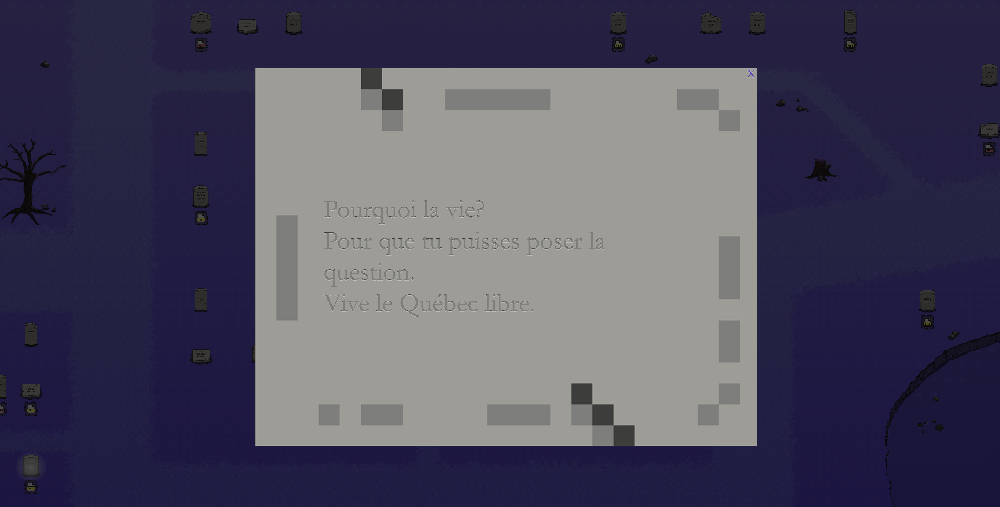
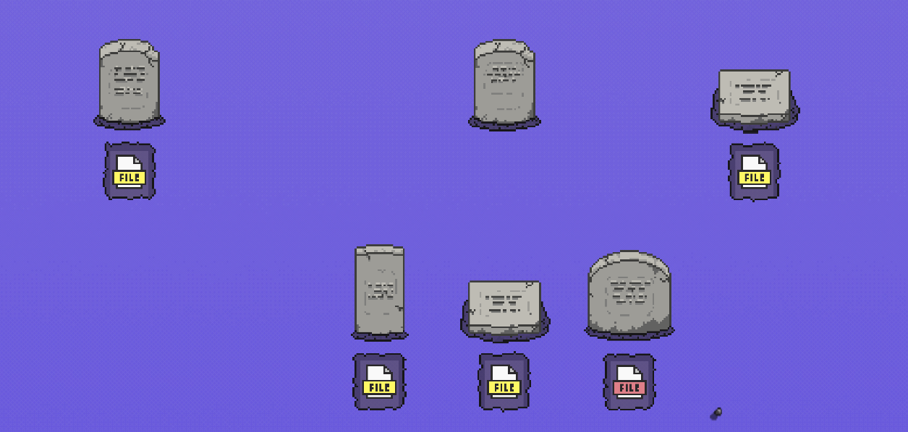

# Digi-Deuil

[Lien du site interactif](https://digideuil.net/)

# Compagnie
aenl

# Équipe
* Anna Eyler
* Nicolas Lapointe

# Collaboration
* Sporobole
* Galerie d'art Antoine-Sirois

# Creation
* 2022

# Présentation
* Lieu: 175, rue Sainte-Catherine Ouest, Montréal
* Espace culturel Georges-Émile-Lapalme
* Place des Arts intérieurs

# Description

Dans cette œuvre l'utilisateur est amené a acheté une pierre tombale acrylique pour 1$ dans une machine distributrice.
Dans cette pierre on peut retrouver une adresse internet menant à un tombeau électronique personnalisé.
Chaque tombe est unique et personnalisable, les participants peuvent y intégrer du texte, une image et même un PDF.
Ses mémoires créer par tous les participants sont a la vue de tous dans le cimetière du site web Digi-Deuil.
  

# Objectif de l'œuvre
* L'objectif est de proposer une réflexion sur la mémoire et l'identité dans l'ère numérique.
* Laisser un héritage derrière nous

# Publique
* Tout le monde peut laisser sa trace il suffit juste de payer 1$ afin d'avoir accès a une pierres tombales numérique menant a une adresse web d'un tombeau personnalisé

# Comment ?

* Composante centrale : Machine distributrice de pierre tombale.
* Fonctionnement : Insérer 1$ dans la machine pour recevoir une pierre tombale avec une adresse web attachée a celle-ci, permettant de laisser un message personnalisable dans une tombe électronique.
* Impact : Il se distingue par sa simplicité et son importance. En effet, il est facile a utilisé et permet de laisser un message ou une image qui pourrait dans un futur proche ou éloigné autant être importante, que drôle, que nostalgique ou même être complètement oublié.

# Appréciation et commentaire personnel
J'ai choisi cette œuvre, car j'aime bien le fait qu'on peut laisser un mémo enterré en héritage et que n'importe qui autant aujourd'hui que dans les années à venir puissent venir interagir avec tous ses messages enterrés avec le temps.
